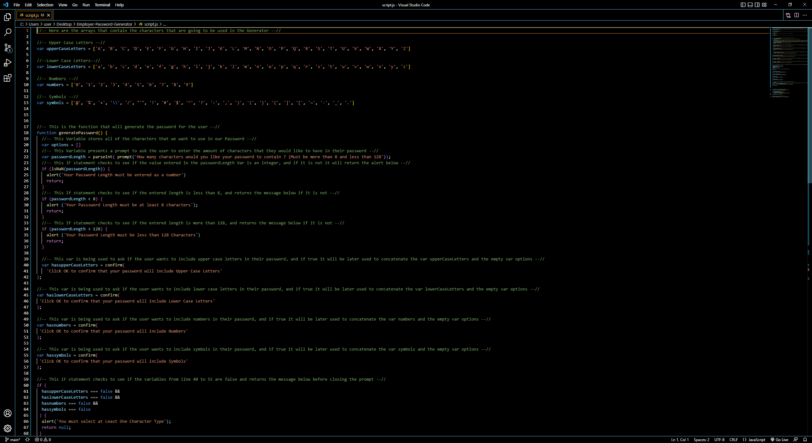
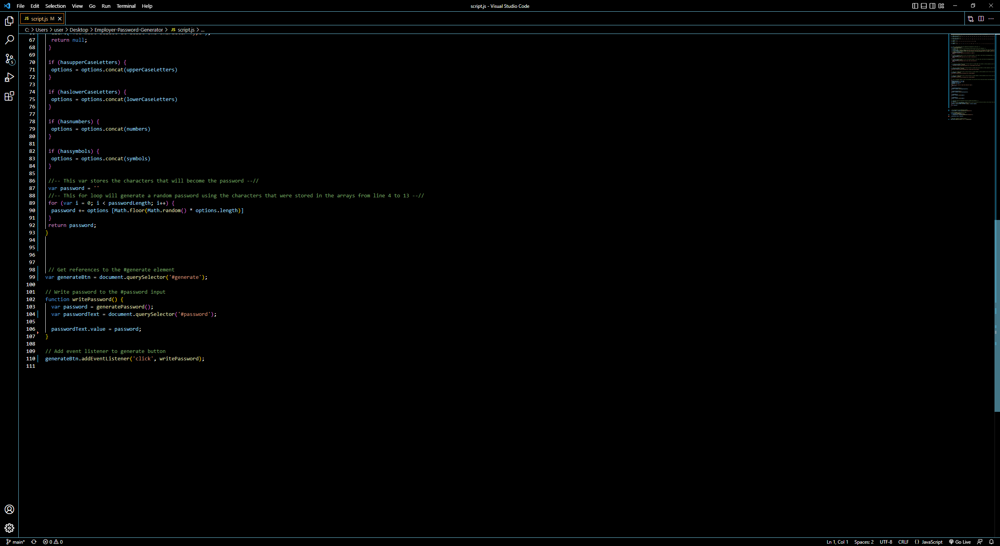
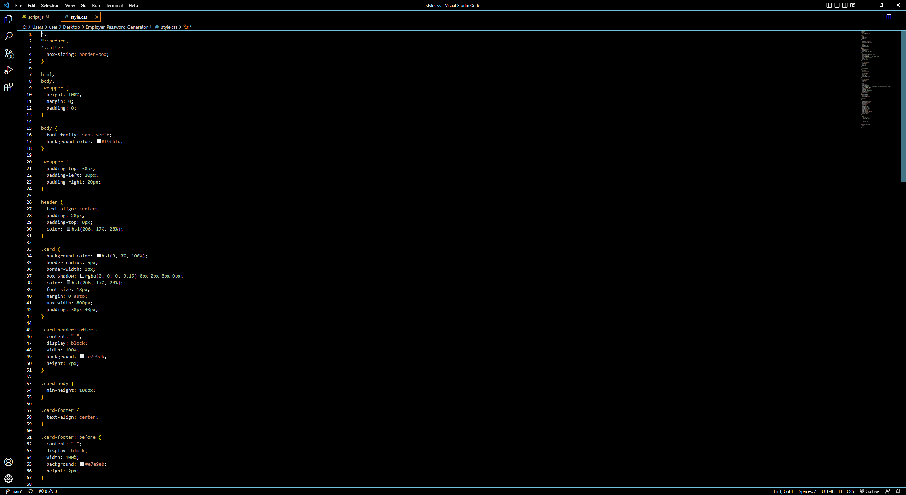
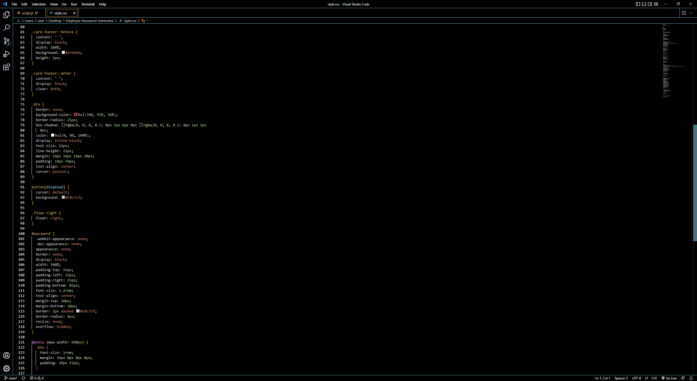
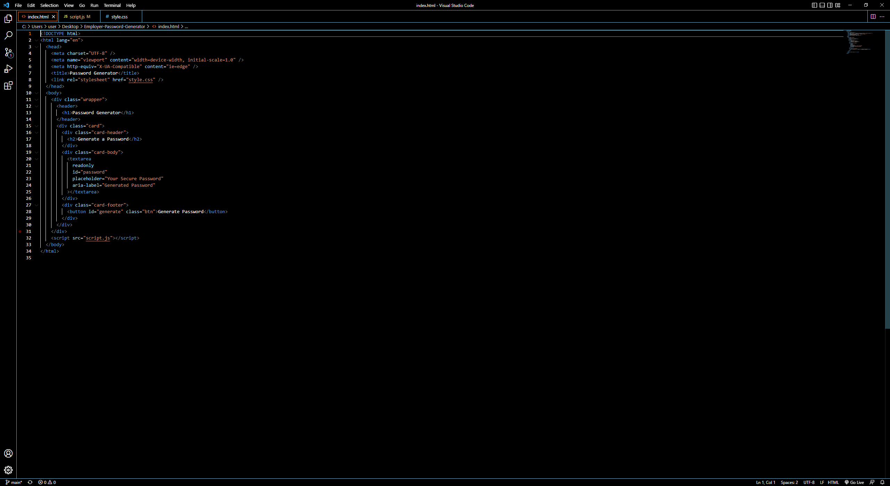
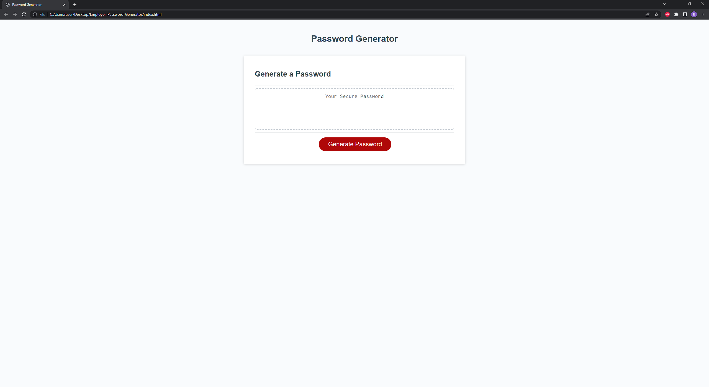

# Employer-Password-Generator
This repository contains code that will generate a random password in order to access secure data.
Below are screenshots of the script.js, HTML and style.css file as well as the webpage.
 
 
 
 
 
 

Below are the URL's for The GitHub Repository and the Deployed Application.
Github Repository: https://github.com/Ervin543/Employer-Password-Generator/edit/main/README.md
Deployed Application: https://ervin543.github.io/Employer-Password-Generator/
